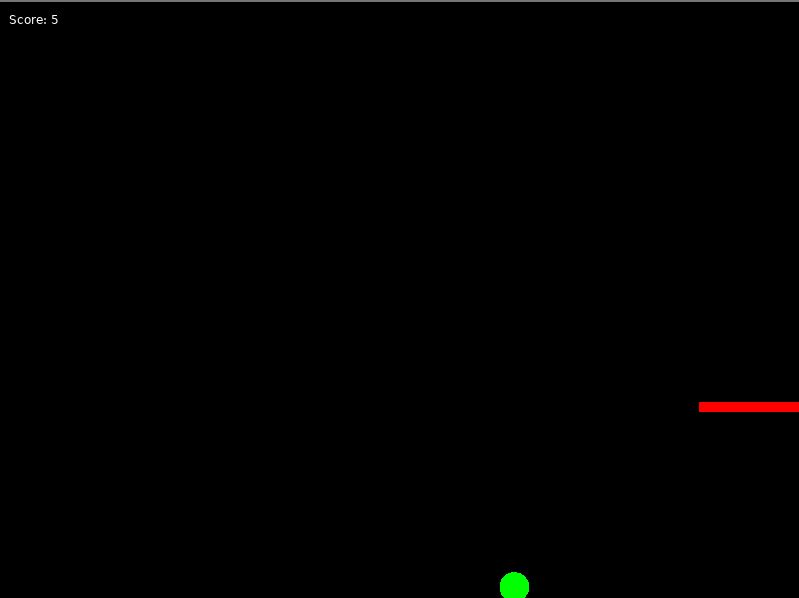

# Basketball Game

## Overview

Basketball Game is a simple basketball simulation game built using the Love2D framework. In this game, you control a ball and attempt to score by shooting it into a hoop. The game features basic physics, including gravity and jumping mechanics, as well as collision detection with the hoop and backboard.

## Controls

- **Left Arrow Key**: Move the ball to the left.
- **Right Arrow Key**: Move the ball to the right.
- **Space Bar**: Make the ball jump.
- **R Key**: Reset the game.

## Installation

1. **Download and Install Love2D**: 
   - Go to the [Love2D website](https://love2d.org/) and download the appropriate version for your operating system.
   - Follow the installation instructions provided on the website.

2. **Download the Game**: 
   - Download the game files from this repository or copy the code into a file named `main.lua`.

3. **Run the Game**:
   - Place the `main.lua` file in a folder.
   - Drag and drop the folder onto the Love2D executable or use the Love2D command-line tool to run the game.

